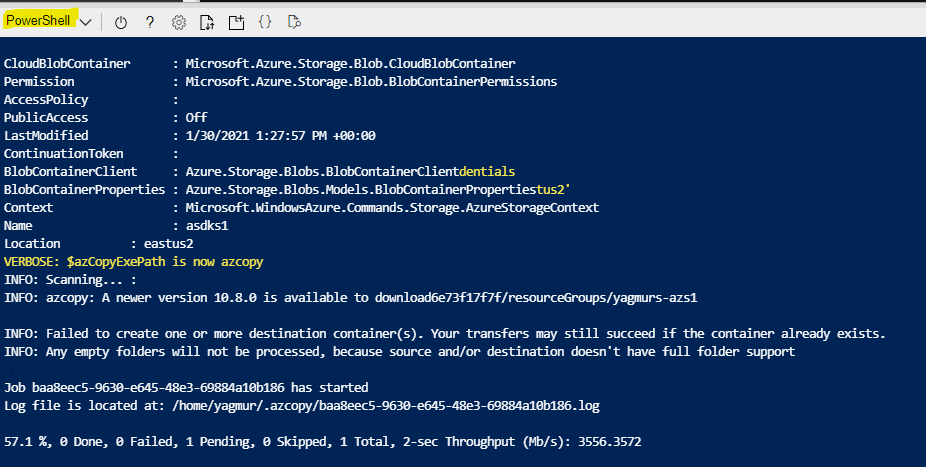

# Azure Stack on Azure VM project

Creates new VM and install prerequisites for Azure Stack Hub Development kit (ASDK) to run Proof of Concept.

## Azure Stack Hub ASF repository

https://github.com/Azure-Samples/Azure-Stack-Hub-Foundation-Core/tree/master/ASF-Training/ASF-slides

## Version Compatibility

The current version of the Deploy-AzureStackonAzureVM.ps1 script has been tested with the following versions:

* ASDK build 1.2102.0.9 (2102)

Starting from  build 2102 the following repository is getting used for ARM template deployment developed by Azure Stack Hub PG.

https://github.com/Azure-Samples/Azure-Stack-Hub-Foundation-Core/tree/master/Tools/ASDKscripts

**IMPORTANT** - this version of the Deploy-AzureStackonAzureVM.ps1 script has been tested with ASDK build 2008 and 2005, and requires minimum of following PowerShell modules

* Az.Accounts - (2.2.1)
* Az.Storage - (3.0.0)
* Az.Resources - (3.0.1)

## Description

Deploy-AzureStackonAzureVM.ps1 script prepares Storage Account and copy VHD file before you calling [ARM Template](/ARMv2/azuredeploy.json)

## Step by Step Guidance

### Step 1 - Download the Deploy-AzureStackonAzureVM.ps1 script

Run the following PowerShell command to install the new installation script. This will also downloads required modules from powershell gallery.

```powershell
Find-Script Deploy-AzureStackonAzureVM | Install-Module -Force
```

Can be run from Azure Cloudshell as well. :)

### Step 2 - Run the Deploy-AzureStackonAzureVM.ps1 script

Once script downloaded from PowerShell gallery, run the following command to locate some examples. 

```powershell
Get-Help Deploy-AzureStackonAzureVM.ps1 -Examples
```

If your scenario does not require customization, simply run Deploy-AzureStackonAzureVM.ps1 without any parameters.
if you provide any parameters, It will use default parameters and will prompt for local Administrator password for the new VM.

#### Example 1

```powershell
Deploy-AzureStackonAzureVM.ps1 -Verbose
```

#### Example 2

```powershell
Deploy-AzureStackonAzureVM -ResourceGroupName myResourceGroup -Region 'West Europe' -VirtualMachineSize 'Standard_E32s_v3'
```



**Note**: The execution of the script takes appoximately 20 mins or so. Please do NOT close the browser or cloudshell window during execution.

### Step 3 - Starting Azure Stack Hub deployment

Once the VM deployed logon to VM using 'Administrator' username and the password provided during the deployment. There are 3 shortcut on the desktop to start ASDK deployment;

* 'Install-ASDK' allow s you to select between ADFS based or AAD (Azure Ad)
* 'ADFS_Install-ASDK' for ADFS based deployment
* 'AAD_Install-ASDK' for Azure AD based deployment

## Step by Step Guidance for Unattended Installation ASDK

### Step 1 - Download the Deploy-AzureStackonAzureVM.ps1 script

Run the following PowerShell command to install the new installation script. If it is not done so.

```powershell
Find-Script Deploy-AzureStackonAzureVM | Install-Module -Force
```

### Step 2 - Run the Deploy-AzureStackonAzureVM.ps1 script for Unattended Installation ASDK

Following code samples will deploy VM then starts ASDK deployment within the VM.

Run the following code by changing **"\<TenantName>"** section accordingly. You will be prompted for passwords of VM and Azure AD GA user.

```powershell
$VmCredential = Get-Credential -Credential "Administrator"
$AzureADTenant = "<TenantName>.onmicrosoft.com"
$AzureADGlobalAdminCredential = Get-Credential "<Admin>@<TenantName>.onmicrosoft.com" #Make sure this account is Global Admin on the tenant

Deploy-AzureStackonAzureVM.ps1 -DeploymentType AAD -AzureADTenant $AzureADTenant -AzureADGlobalAdminCredential $AzureADGlobalAdminCredential -VmCredential $VmCredential -Verbose
```

or

Once the following code run, you will be prompted for Azure AD Tenant, Azure AD GA Credentials and VM Credentials.

```powershell
$VmCredential = Get-Credential -Credential "Administrator"
$AzureADTenant = Read-Host -Prompt "Enter Azure AD Tenant name in the following format: <TenantName>.onmicrosoft.com"
$AzureADGlobalAdmin = Read-Host -Prompt "Enter Azure AD Tenant Global Administrator's UPN in the following format: <Admin>@<TenantName>.onmicrosoft.com"
$AzureADGlobalAdminCredential = Get-Credential $AzureADGlobalAdmin

Deploy-AzureStackonAzureVM.ps1 -DeploymentType AAD -AzureADTenant $AzureADTenant -AzureADGlobalAdminCredential $AzureADGlobalAdminCredential -VmCredential $VmCredential -Verbose
```

Note: Values and permissions for **AzureADGlobalAdminCredential** and **AzureADTenant** not getting validated at the moment. Make sure them are correct.

## Support Statement

This solution (Running ASDK on top of Azure VM) is not officially support by **Microsoft** and experimental, may not work in the future.

## Issues and features

### How to file a bug

1. Go to our [issue tracker on GitHub](https://github.com/yagmurs/AzureStack-VM-PoC/issues)
1. Search for existing issues using the search field at the top of the page
1. File a new issue including the info listed below

### Requesting a feature

Feel free to file new feature requests as an issue on GitHub, just like a bug.

 > Yagmur Sahin
 >
 > Twitter: [@yagmurs](https://twitter.com/yagmurs)
